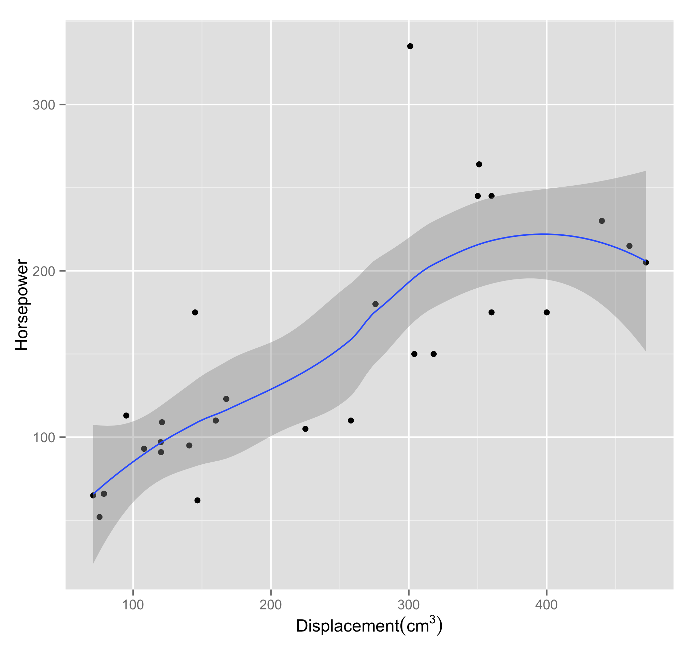

#  Thinking about learning objectives as a process of modeling

## 1 - Modeling begins before you ever touch a computer

- How do I understand the system of interest?
- Within that system, what phenomena am I interested in?
- What entities do I think are relevant for my model?
- How might I qualitatively describe entity relationships in the model? (Example: predators hunt prey, so predators should have some contribution to the reduction of prey.)
- What simplifications do I *know* I'm making?
- How can I express expectations of/predictions about the model? (E.g., with one wolf and 10 million rabbits, I don't think there will be much of a predator effect. Or: here's a sketch of the path I think this orbiting body might take. Or: based on [my experiences with kerbal space program](https://kerbalspaceprogram.com/kspstore/index.php?p=22), I figure the object would take a path like this.)

### 1.1 For a given situation-to-be-modeled, Students will be able to

- **describe one or more phenomena** they want their model to address.
- **state and justify** (with words, pictures, gestures) which **entities they care about** for this model. . ("Our model needs to include/account for ___ because ___). This can also be phrased as **state and justify the inclusion of entities in their model**
- **identify and justify simplifications** their model makes. (Our model ignores air resistance because ___)
- **qualitatively describe entity relationships in the model.** (E.g., the traffic jam may propagate backwards through traffic, because each car won't decelerate until it's within x of the rear bumper of the car in front. Or: roughly speaking, a wolf will seek a rabbit if it finds one, and a rabbit will evade a wolf if it detects one.)
- **predict or hypothesize how the model may behave** (E.g., If we give cars on the highway high initial speeds and a very low braking distance threshold (how far from the next car they'll be before they start decelerating), there will be guaranteed crashes. Or: If rabbits are fast and can hear wolves coming from far away, the wolves won't be successful predators. But, if we can somehow get the wolves to hunt as a pack and surround a rabbit, they should be better able to catch rabbits.) One way we might start to assess this is "if you wanted to tweak the simulation to make the wolves better hunters without changing the rabbit behavior, what might you do?" Or "suppose the wolf population could adapt and become more efficient at hunting rabbits. Give an example of a new behavior you might give them to hunt more efficiently and show in pseudocode how you might roughly encode the behavior into the model.)

## 2 - Formalizing the model

- What are different ways we might encode/represent a model? (difference equations? Python Code? Other?)
- For many of the models we'll build, we'll need to be able to express behaviors, do some calculations, and store/move/manipulate some data. In service of those aims, in Python, how can we
	- Store information for use later?
	- Represent numbers and convert between their forms? (Int, Float)
	- Perform operations on numbers (for example, arithmetic. If you've never programmed before, `*` as the multiplication operator may not be obvious)
	- Represent letters/words?
	- Perform operations on letters/words? (Find regular patterns, make substitutions, convert case, concatenate, split)?
	- Create data by composing words/letters and numbers? (Lists are ordered like trains. Dicts are kind of like buckets of labeled stuff.)
	- Perform repeated operations on those compositions, including iteration. (If we learn primitives and manipulating primitives, then it makes sense to learn compositions and manipulating compositions.)
	- Bundle up repeated operations so they're easier to invoke/apply later (function definition)
	- Pull in external collections of bundled-up procedures (import other modules/packages/libraries)
- For many of the models we'll build, we'll try to take advantage of specific advantages we get for free with SciPy and NumPy. In SciPy/NumPy how can we:
	- Get statistical information about a collection of numerical data. (the `max`, `min`, `cumsum`, `var` and `mean` methods of `ndarray`, for example)
	- Perform operations using the numbers in a collection (the `sum` method of an `ndarray`, for example)
	- Iterate over an array of data (`numpy.nditer`?)
	- // Fill in more objectives here
- How can we see different representational forms as comparable articulations of the same model?
	- How do we see relationships between difference equations and a model produced in code?
	- // fill in more stuff here
- What are the different kinds of engines/paradigms that can drive models?
	- Deterministic systems with a centralized parameter (such as time), where objects in the model update in response to discrete, progressive changes to that parameter. Here, our main task is to specify update procedures as functions of the parameters of the system.
	- Agent-based Modeling, where we're trying to produce simple rule-based behavior to govern individual parts of the system. Rather than thinking of these as system-wide updates based on parameters, we can think of this as individual agents *reacting* to their own state and what's around them.
	- Markov Chain Monte-Carlo

### 2.1 When it comes to formalizing models, students will be able to

- In base Python:
	- **Store information** for use later
	- **Retrive Stored Information**
	- **Represent numbers and convert** between their forms (`Int`, `Float`)
	- **Perform operations on numbers** (for example, arithmetic. If you've never programmed before, `*` as the multiplication operator may not be obvious)
	- **Represent letters/words**
	- **Perform operations on letters/words** (Find regular patterns, make substitutions, convert case, concatenate, split)?
	- **Create data by composing words/letters and numbers** (Lists are ordered like trains. Dicts are kind of like buckets of labeled stuff.)
	- **Perform repeated operations on those compositions**, including iteration. (If we learn primitives and manipulating primitives, then it makes sense to learn compositions and manipulating compositions.)
	- **Bundle up repeated operations** so they're easier to invoke/apply later (function definition)
	- **Pull in external collections of bundled-up procedures** (import other modules/packages/libraries)
- In NumPy / SciPy
	- **Get statistical information** about a collection of numerical data. (the `max`, `min`, `cumsum`, `var` and `mean` methods of `ndarray`, for example)
	- Perform operations using the numbers in a collection (the `sum` method of an `ndarray`, for example)
	- **Iterate over an array of data** (`numpy.nditer`?)
	- // Fill in more objectives here
- Across Formal Models:
	- **Express and discuss relationships** between difference equations and a model produced in code(?)
	- // fill in more stuff here
- Across Formal Modeling Paradigms:
	- **Describe and compare the mechanisms of **
		- Deterministic systems with a centralized parameter (such as time), where objects in the model update in response to discrete, progressive changes to that parameter. Here, our main task is to specify update procedures as functions of the parameters of the system.
		- Agent-based Modeling, where we're trying to produce simple rule-based behavior to govern individual parts of the system. Rather than thinking of these as system-wide updates based on parameters, we can think of this as individual agents *reacting* to their own state and what's around them.
		- Markov Chain Monte-Carlo

## 3 - Interrogating the model

### How we think about interrogating the model

- How do I figure out what's happening when I run my model?
- What information can I get about my model?
	- What diagnostic plots can I get from my model? 
		- lines/functions of best fit 
		- residuals
		- histograms
	- What numerical summaries can I get from my data?
		- 5-number summary (Tukey)
		- Measures of central tendency/typicality
		- Measures of variation
		- Extrema and outliers
		- (if available) tables of predicted-vs-actual model results for Supervised learning situations
- How does my model behave in extrema/limiting cases?
	- What are some ways I could generate random data to throw at this model?
	- How can I generate extreme data? What would that mean?
- Is this model answering the question I want to ask?
- In retrospect, does what comes out of the model echo how the real system behaves/should behave?
- What statements can I make (in plain writing, say English) about the performance of my model?

### 3.1 Learning Objectives: For a given model, students will be able to

- **Enumerate** some techniques (visual, numerical, or other) for interrogating a model. Examples would include calculating a measure of central tendency, plotting actual data vs. model fit, creating distribution diagrams/histograms/kernel density estimates.
- **Identify the error in their models**, through (for example) tabular summaries of residuals, cumulative residual plots, smoothing and confidence intervals. Example: .
- **Create a plot** to assess model fit
- **Judge the appropriateness of a model** using diagnostic plots (and justify their reasoning)

## 4 - Refining the model

- How do I achieve a better fit?
	- What constitutes a "better fit?"
- How do I think about the complexity of my model?
	- What *is* model complexity?
	- Should I add terms to my model?
	- Should I change the value of any of the input parameters?
	- Should I add interactions to my model?
	- Should I rethink the mathematical relationships I've posed? (the data looks nonlinear, but I'm attempting a linear fit)
- How do I understand the trade-off between interpretability and model complexity? 
- If I make the model more complex, how will that impact:
	- The time it takes to program/debug
	- The time it takes to actually execute on a computer
	- The time it takes to interpret/make sense of the results?
- What's the least I can do to make my model useful? What's the minimal amount of complexity I need to encode to get something useful?
- What information are my diagnostics giving me? 
	- How do I think about model refinements in light of that information

### 4.1 - Learning Objectives: Students will be able to

- **compare two iterations on a model** (say, a linear model and a quadratic model) and argue for which model better captures the phenomenon
- For a given model, **interpret their model qualitatively** 
- For a given model, **suggest and justify a refinement to it**

## 5 - Sharing/publicizing the model (reproducible research/open science)

### 5.1 - Learning Objectives: Students will be able to

- **Create an iPython Notebook** that mixes both Python code and explanatory markdown
- **Share an iPython Notebook** using NBconvert / NBviewer
- **Download someone's existing iPython Notebook**
	- Possibly by *forking* the repository
	- **review someone else's code**
	- **modify their own fork** of the upstream repository
	- **justify their modifications**
	- **Issue a pull request** on the upstream repository

## 6 - Assessing/Comparing/Debating models

// Some of the really cool intellectual meat. Given the kind of diagnostic information we get (cluster 3) and possibly being able to share our models (cluster 5), how do we make decisions about how well the model is working and whether to refine it (cluster 3). This is where we get into the work of justifying a model we've built, exploring whether our asusmptions (cluster 1) held sway, and so on.

// 2015-08-26 - I actually think much of this is covered by the first 5 clusters :-/

---

# From the draft NSC 204 syllabus (2015-08-03)

By the end of this course, you will be able to:

1.	Gain insight into physical, biological, and social systems through the use of computational algorithms and tools.
2.	Write programs to solve common problems in a variety of disciplines.
3.	Identify salient features of a system that can be codified into a model.
4.	Manipulate, analyze, and visualize datasets and use this data to evaluate models.
5.	Have an understanding of basic numerical methods (e.g., numerical integration, difference equations, Monte Carlo) and be able to use them to solve problems.
6.	Be able to take results from a scientific computing problem and present it both verbally and in writing.

# From the NSC 204 Course Request form (2015-03-29)

## Learning Objectives

By the end of this course, students will be able to:

- Write programs to solve common problems in a variety of disciplines.
- Gain insight into physical, biological, and social systems through the use of computational algorithms and tools.
- Identify salient features of a system that can be codified into a model.
- Manipulate, analyze, and visualize datasets and use this data to evaluate models.

## Outline of major topics

- Mathematical modeling (this forms the overarching theme of the course, and will constitute roughly half of the overall course content, examples, and assessments)
- Basics of functional programming, including variables and types, functions, data structures (e.g., strings, lists, dictionaries)
- Plotting and data visualization
- Numerical statistics 
- Linear regression 
- Difference equations 
- Advanced techniques (possibly Monte Carlo, agent-based modeling, numerical calculus)
